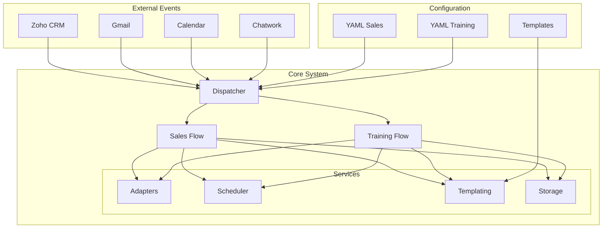

# ダンドリワーク AIエージェントシステム実装ガイド（Sales/研修エージェント共通MVP）

## 🎯 ゴール（2週間でMVP）
設定駆動（YAML）＋テンプレート駆動（メール/Chatwork）＋イベント駆動の骨格をローカル完結で実装。

後日、Zoho/Gmail/Calendar/Chatwork/署名（CloudSign/GMO）にアダプタ差し替えで接続。

## 📝 進め方（段階）
1. **ローカル実装**：モックAPIで end-to-end（E2E）を通す
2. **サンドボックス接続**：各SaaSのOAuth/トークンでアダプタ差し替え
3. **本番切替**：環境変数とレート制御を本番値に

## 📁 リポジトリ構成（TypeScript推奨）

```bash
/configs/            # 設定ファイル
  dw_sales_agent.yaml
  dw_training_agent.yaml

/templates/          # テンプレートファイル
  email/             # *.mj.txt（Jinja/Handlebarsライク変数）
  chatwork/          # *.md

/src/
  dispatcher/        # イベント→フローのルーティング
    index.ts
  
  flows/             # ビジネスフロー
    sales.ts
    training.ts
  
  domain/            # ドメインモデル
    models.ts        # Deal/Program/Session…型定義
  
  services/
    adapters/        # 外部サービスアダプタ
      gmail.ts
      calendar.ts
      zoho.ts
      chatwork.ts
      sign.ts
    
    mocks/           # モックアダプタ
      gmail.mock.ts
      calendar.mock.ts
      zoho.mock.ts
      chatwork.mock.ts
      sign.mock.ts
    
    templating/      # テンプレート処理
      render.ts      # 変数展開
    
    scheduler/       # スケジューリング
      scheduler.ts   # quiet hours/タイマー
    
    storage/         # ストレージ処理
      drive.ts       # 添付命名/格納ルール
  
  lib/               # ユーティリティ
    logger.ts
    time.ts
    normalizers.ts   # ソース正規化/重複キー等
  
  config/            # 設定管理
    loadConfig.ts    # YAML→型安全（zod）

/events/             # テスト用イベント
  sample_*.json

/tests/              # テストコード
  unit/
  e2e/

/scripts/            # ビルドスクリプト
  dev.sh
  build.sh

.env.example         # 環境変数テンプレート
```

## 🔧 主要コンポーネント（実装指針）

### 1. Dispatcher
- `event.type`でフローに振り分け
- 冪等性（idempotency-key）必須

### 2. Flow(s)
**Sales MVP**：工程 7→8→22→添付アップロード を通す
- 初回コール記録
- 不在時のメール/SMS送信
- 見積書PDF生成と添付

**Training MVP**：P5（ドラフト作成）→T-3/T-1リマインド を通す
- 契約締結後の8回分セッションドラフト
- 開催3日前/1日前のリマインダー

### 3. Adapters
- `adapters/*` は同一インターフェースで「mock/real」を差し替え可能に
- 環境変数でアダプタ選択

### 4. Scheduler
- 営業時間・クワイエットタイム管理
  - SMS：21:00–08:00禁止
  - メール：20:00以降は翌朝送信
- 一元管理による送信タイミング制御

### 5. Templating
- `render(template, variables)`
- Bcc、署名、命名規則はYAMLから注入

### 6. Normalizers
- ソース正規化
- 会社名ファジー一致（≥0.8）
- テリトリー割当

## 💻 最小インターフェース例

```typescript
// src/services/adapters/email.ts
export interface EmailAdapter {
  draft(input: {
    to: string[];
    cc?: string[];
    bcc?: string[];
    subject: string;
    body: string;
    attachments?: Buffer[];
  }): Promise<{ draftId: string }>;
  
  send(draftId: string): Promise<void>; // MVPはdraftまででOK
}

// src/dispatcher/index.ts（例）
type Event = {
  id: string;
  type: "Sales.InitialCallLogged" | "Sales.QuoteReady" | 
        "Training.ContractSigned" | "Training.Tminus";
  payload: any;
};

export async function handle(e: Event) {
  // configを見て flows.sales(e) / flows.training(e) を呼び出し
}
```

## ⚙️ 設定（YAML）— 必須キーのみ

### Sales設定
- 営業時間：9–18
- SMS：URL禁止
- Bcc：sales@dandori-work.com
- 添付命名：【DW提案書】{顧客名}_{YYYYMMDD}.pdf

### Training設定
- 開催時間：10–18（土曜可/日祝不可/20時以降不可）
- リマインダー：T-3/T-1
- 録画保持：12ヶ月（提案）

### 共通設定
- ソース正規化辞書
- テリトリー割当
- 警告しきい値（値引き≥15%で警告のみ）

## 📅 スプリント計画（MVP）

### Sprint 0（Day1-2）
- リポジトリ雛形作成
- zod設定ローダー実装
- テンプレートレンダラー実装
- モックアダプタ作成
- サンプルイベント投入CLI

### Sprint 1（Day3-6｜Sales）
- Salesフロー実装
  - InitialCall→NoAnswer→DraftEmail/SMS→QuotePDF生成→Zoho添付
- 添付命名・フォルダ規約実装
- Quiet hours対応
- ユニットテスト（正規化/命名）

### Sprint 2（Day7-10｜Training）
- Trainingフロー実装
  - ContractSigned→8回ドラフト生成→Calendar招待
  - T-3/T-1案内（メール/Chatwork）
- 受講者リストの雛形CSV→招待バルク生成

### Sprint 3（Day11-14）
- 反社SOPログの型と保存
- レポート雛形生成
- E2E通しテスト

## 🧪 テスト戦略

### Unit Test
- 正規化（表記ゆれ→固定値）
- ファジーマッチ
- 命名/Quiet hours判定

### Contract Test
- アダプタIFのモックとスナップショット（テンプレート出力）

### E2E Test
- `/events/*.json` を順に投げてメール下書き・招待・PDF生成・添付まで検証

### 再送安全性
- 同一event.idは多重実行を無視（冪等テーブル or メモリMapでも可）

## 🔐 セキュリティ/運用

### Secrets管理
- 環境変数（.env→.env.exampleにプレースホルダ）
- ID/PWは絶対にGitへ含めない

### レート制御
- 指数バックオフによるリトライ
- API失敗はキュー戻し＋警告ログ

### 監査ログ
- フォーマット：`{when, who, what, before→after}`
- JSONライン形式で出力

## 🔄 接続切替チェックリスト（mock→real）

- [ ] **Gmail API/OAuth**：送信は下書きのみから開始
- [ ] **Calendar**：招待は「仮」作成→人承認で確定
- [ ] **Zoho**：/Attachments へのPOST検証（Deal/Lead）
- [ ] **Chatwork**：ルーム命名規則＆初回ポスト
- [ ] **署名**：CloudSign（Sales）/GMO（Training）はドラフト作成まで

## ✅ Doneの定義（MVP）

### Sales
イベント投入で不在→メール下書き＋見積PDF生成→Zoho「添付」保存が自動で起きる

### Training
ContractSignedで8回ドラフト＋招待、T-3/T-1で案内下書き＋Chatwork投稿が自動で起きる

### 共通
全処理がYAML差し替えのみで挙動変更できる

## 🚀 クイックスタート

```bash
# 環境構築
npm install
cp .env.example .env

# 開発サーバー起動
npm run dev

# テスト実行
npm test

# E2Eテスト
npm run test:e2e

# ビルド
npm run build
```

## 📊 アーキテクチャ図



## 📈 メトリクス監視（将来実装）

- イベント処理数/時間
- API呼び出し成功率
- テンプレート生成時間
- キュー滞留数
- エラー率とリトライ回数

## 🔗 関連ドキュメント

- [API仕様書](./docs/api.md)
- [テンプレート変数一覧](./docs/templates.md)
- [エラーハンドリングガイド](./docs/error-handling.md)
- [デプロイメントガイド](./docs/deployment.md)

---

**Version**: 1.0.0-MVP  
**Last Updated**: 2025-01-13  
**Author**: ダンドリワーク開発チーム